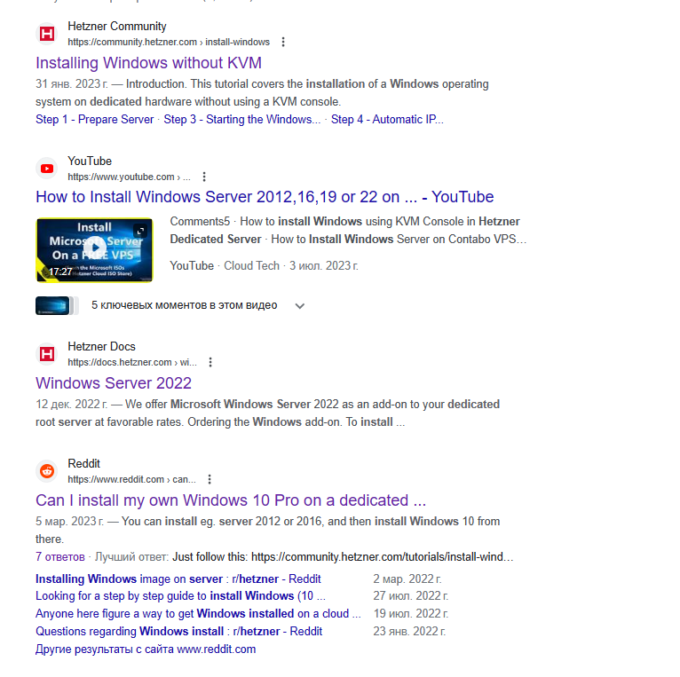

Всем привет! Решил тут написать про свой опыт недавний установки виндовса на дедик клиенту. Сразу скажу - это было не просто и весело (**пострадало 7 дедиков, пока до меня дошло в чем проблема**).

Полная инструкция установки Windows на NVMe диск тут - [**Установка Winodws**](https://www.waif.cc/docs/hetzner/install-windows)

Начнем с того - что пришел заказ на сетап винды на дедик (**под 1с)**, подумал я такой **“ну минут 30 и все, делов то”**, а оказалось меня наебали и причем конкретно. 

Идем в гугл и пишем такой запрос **“install windows on hetzner dedicated server”** и мы получаем кучу разных ссылок, пример внизу

Я же выбираю первую ссылку [**оригинальная статтья**](https://community.hetzner.com/tutorials/install-windows), вот тут и начинается интересное - доходим до пункта “**Start `parted` on the desired drive**:” и видим там есть команда “**parted /dev/sda**” - для создания тома. 

Теперь раскрываю интересную вещь в новых версиях на хецнере диск не имеет раздел “**sda**”, а имеет раздел “**nvme0n1**” (**но не уверен, что такое будет на HDD диске, я же словил такой рофл на NVMe диске**). В итоге у нас получается, что мы должны заменить “**sda**” на “**nvme0n1**” и на выходе мы получим “**parted /dev/nvme0n1”** и дальше идти дальше по инструкции, создавая том и скачивая образы нужной нам виндовс.

Все это я пытался понять на протяжении недели и при этом сломал 7 дедиков (**один из них даже не отвечал на второй день**), но все завершилось и до меня дошло (не без помощи знакомых). Полная инструкция как ставить виндовс на нвме диски - [**установка windows**](https://www.waif.cc/docs/hetzner/install-windows)

Если кто-то захочет заказать сервер на **Windows/Linux**, пиши сюда - [**Телеграм**](https://t.me/wk_sline)