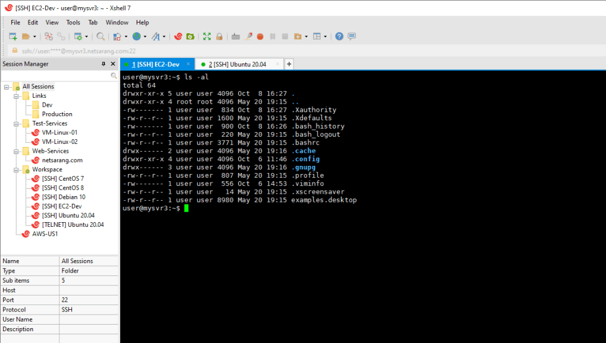
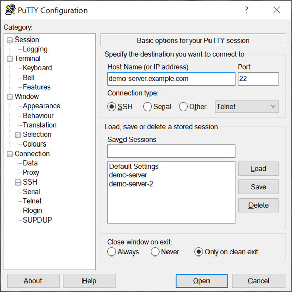
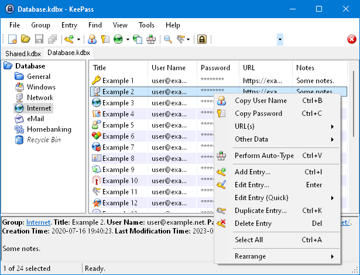
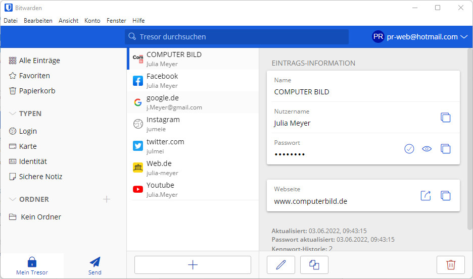
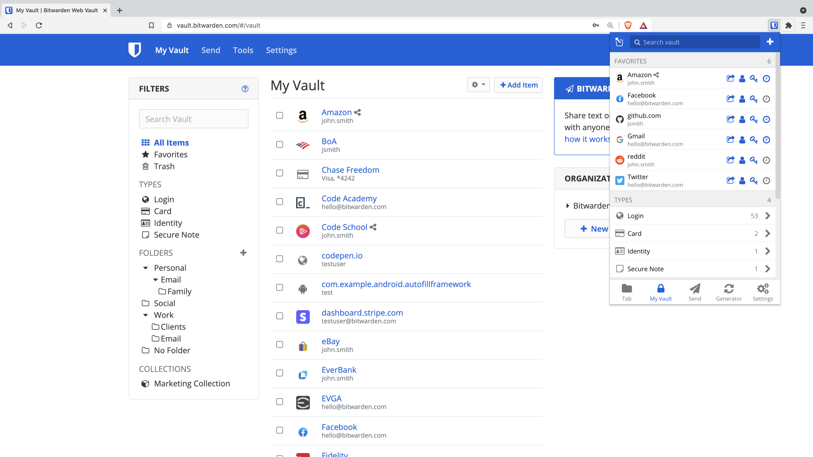

Хочу поделиться с вами софтом, который я использую каждый день, тестировал разные софты, с чего-то ушел, что-то открыл новое, в общем сделал я мини подборку софта, мб будет вторая часть, так как тут не весь). 

Сразу скажу, что в данном посте есть как бесплатный софт, так и платгый, ну и это субъективно мой топ по софту.

## SSH-Клиент 

Пожалуй тема очень обширная, так как их существует довольно много, но я использую пока что только два клиента, но активно ищу интересней клиенты. 

**Xshell** - ssh-клиент, очень удобный как для новичков, так и для опытных пользователей. Он позволяет сохранять пароли, так что вам не нужно вводить их каждый раз. Вы можете создавать папки для разных проектов и открывать множество подключений в одном окне, но в разных вкладках. Это очень удобно, так как можно одновременно видеть до четырех вкладок на экране.

Скачать можно тут -> [**Xshell**](https://www.netsarang.com/ru/xshell/)

**Putty** -  это тоже хороший SSH-клиент, с которого я начинал и который до сих пор использую для небольших задач. В Putty нет функции сохранения паролей, поэтому их приходится вводить вручную каждый раз. Этот клиент подойдет для новичков, так как он прост в использовании и понятен.

Скачать можно тут -> [**Putty**](https://putty.org.ru/)

На деле, данных клиентов очень много, их всех можно найти в интернете.

## Менеджер паролей

Теперь о хранении паролей. Многие люди используют браузер для этого (но это не так надежно, как менеджер паролей). Я тоже раньше хранил пароли в браузере, но теперь стараюсь переходить на менеджеры паролей.

Ранее я пароли записывал на листочке бумаги, потом в тетрадку, дальше перешел в текстовый файл (**txt - наше все**). Затем я начал сохранять пароли в браузере и вот уже в последние несколько лет начал использовать менеджер паролей.

Один из первых менеджеров, который я использовал, был **KeePass** - бесплатный и безопасный. Вы, возможно, слышали о **1Password**, **LastPass**, **NordPass** и других. **KeePass** - это то же самое, но бесплатно и безопасно. Я использовал его в течение года, пока не узнал о **Bitwarden**.

Скачать можно тут -> [**KeePass**](https://keepass.info/)

**Bitwarden** - это минималистичный и безопасный менеджер паролей. Все данные хранятся на их серверах, и вы можете проверить - [**отчеты аудитов безопасности**](https://bitwarden.com/help/is-bitwarden-audited/). Несмотря на то что данные хранятся на сервере, аудиты подтверждают его безопасность. В отличие от **KeePass**, **Bitwarden** может синхронизироваться с другими устройствами, и есть возможность установить его как приложение в браузере. У **Bitwarden** есть как бесплатная, так и платная версии, и его можно установить на свой сервер.

Скачать можно тут -> [**Bitwarden**](https://bitwarden.com/)

Остальной софт, напишу в другой части, так как слишком много будет в одной части) Так же позже распишу подробно про **Bitwarden**, что он из себя представляет и т.д.