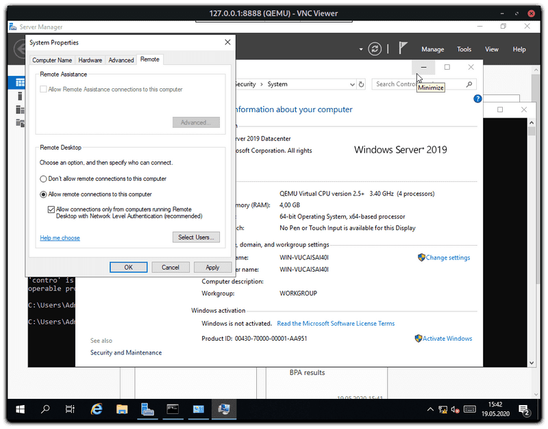

# Установка Windows на Hetzner Dedicated Server

Введение
В этой инструкции расскажу как установить операционную систему **Windows** на выделенное оборудование без использования **KVM-консоли**.

Необходимые условия

- Выделенный сервер, работающий в системе **Rescue System**
- Более [**8 ГБ**](https://my.karasiq.space/) оперативной памяти на сервере

## Шаг 1 - Подключение к SSH

Для последующей установки через VNC необходим SSH-коннект. В противном случае доступ к установке можно получить через Интернет.

В **Linux** и **Windows** с установленным **OpenSSH** просто выполните следующую команду локально и войдите на сервер:

```bash
ssh root@your_host -p 22
```

## Шаг 2 - Подготовка сервера

Когда сервер находится в режиме **Rescue System (Linux x64)**, необходимо сделать следующее

```bash
apt update  — Обновить все пакеты
apt install qemu-kvm — Установить сервис виртуальной машины

apt update && apt install qemu-kvm - Для тех кому лень писать лве команды)
```


###  Загрузка образа

Затем необходимо загрузить обрах на сервер, в виде **ISO-файл Windows**. Возможны следующие варианты:

- Загрузить чере **SFTP**
- Загрузить **ISO-образ** с **Microsoft / Hetzner** и другие через **wget**

:::tip
[**Windows Server 2022 (ENG)**:](https://mirror.hetzner.de/bootimages/windows/SW_DVD9_Win_Server_STD_CORE_2022_2108.15_64Bit_English_DC_STD_MLF_X23-31801.ISO) - Нажми для скачивания

[**Windows Server 2019 (ENG)**:](https://mirror.hetzner.de/bootimages/windows/SW_DVD9_Win_Server_STD_CORE_2019_1809.11_64Bit_English_DC_STD_MLF_X22-51041.ISO) - Нажми для скачивания

[**Windows Server 2016 (ENG)**:](https://mirror.hetzner.de/bootimages/windows/SW_DVD9_Win_Server_STD_CORE_2016_64Bit_English_-4_DC_STD_MLF_X21-70526.ISO) - Нажми для скачивания
:::

Загрузить образ можно, например, с помощью **wget** или **curl**:

```bash
wget <image> — Пример использования команды
```

**Windows Server 2022 (ENG)**
```bash
wget https://mirror.hetzner.de/bootimages/windows/SW_DVD9_Win_Server_STD_CORE_2022_2108.15_64Bit_English_DC_STD_MLF_X23-31801.ISO
```

**Windows Server 2019 (ENG)**
```bash
wget https://mirror.hetzner.de/bootimages/windows/SW_DVD9_Win_Server_STD_CORE_2019_1809.11_64Bit_English_DC_STD_MLF_X22-51041.ISO
```

**Windows Server 2016 (ENG)**
```bash
wget https://mirror.hetzner.de/bootimages/windows/SW_DVD9_Win_Server_STD_CORE_2016_64Bit_English_-4_DC_STD_MLF_X21-70526.ISO 
```
### Подготовка диска

После подключения **ISO-образа**, нужно подготовить диск для установки системы. Для этого нужно создать таблицу разделов

:::tip
**Внимание Все данные на диске (дисках) будут удалены во время следующих шагов:**
:::

Запускаем разметку на нужном диске `parted`:

```bash
parted /dev/nvme0n1
```

Создание таблицы разделов для дисков размером менее **2 ТБ**:
```bash
mklabel msdos
```

Создание таблицы разделов для дисков объемом более **2 ТБ**:
```bash
mklabel gpt
```
Все это должно выглядеть примерно так:

```bash
root@rescue ~ # parted /dev/nvme0n1
GNU Parted 3.2
Using /dev/nvme0n1
Welcome to GNU Parted! Type 'help' to view a list of commands.
(parted) [mklabel msdos]
Warning: The existing disk label on /dev/nvme0n1 will be destroyed and all data on this disk will be
lost. Do you want to continue?
Yes/No? [yes]
(parted) [quit]
Information: You may need to update /etc/fstab.
```

### Шаг 3 - Запуск установки Windows

Теперь можно приступить собственно к установке **Windows**. Для этого на сервере нужно выполненить следующую команду (измененная соответствующим образом).

**Windows Server 2022 (ENG)**
```bash
qemu-system-x86_64 -enable-kvm -smp 4 -m 4096 -boot d -cdrom SW_DVD9_Win_Server_STD_CORE_2022_2108.15_64Bit_English_DC_STD_MLF_X23-31801.ISO -drive file=/dev/nvme0n1,format=raw,media=disk -vnc :1
```

**Windows Server 2019 (ENG)**
```bash
qemu-system-x86_64 -enable-kvm -smp 4 -m 4096 -boot d -cdrom SW_DVD9_Win_Server_STD_CORE_2019_1809.11_64Bit_English_DC_STD_MLF_X22-51041.ISO -drive file=/dev/nvme0n1,format=raw,media=disk -vnc :1
```

**Windows Server 2016 (ENG)**
```bash
qemu-system-x86_64 -enable-kvm -smp 4 -m 4096 -boot d -cdrom SW_DVD9_Win_Server_STD_CORE_2022_2108.15_64Bit_English_DC_STD_MLF_X23-31801.ISO -drive file=/dev/nvme0n1,format=raw,media=disk -vnc :1
```

Далее установку можно продолжить через **VNC**. Можно подключиться из выбранной тобой программы просмотра **VNC** по следующему адресу: `айпи_сервера:1`

### Шаг 4 - Включение RDP и отключение брандмауэра

Для последующего подключения к серверу по RDP необходимо активировать эту функцию:



Чтобы минимизировать дальнейшие источники ошибок, имеет смысл отключить **брандмауэр Windows** перед перезагрузкой (но это необязательно).

Теперь можно завершить работу **Windows** и перезапустить сервер. Через несколько минут должно появиться подключение к серверу по **RDP**.

После завершения работы **Windows**, возвращаемся в консоль и пишем эту команду

```bash
root@rescue ~ # reboot - Перезапускаем сервер
```

Далее ждём минут 5-10 и подключаемся через **RDP**.